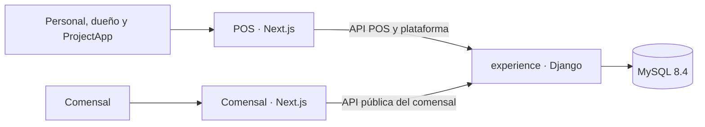
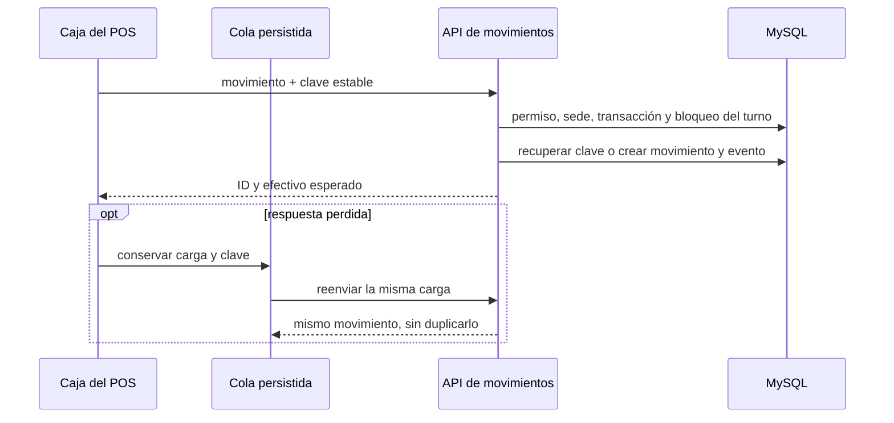
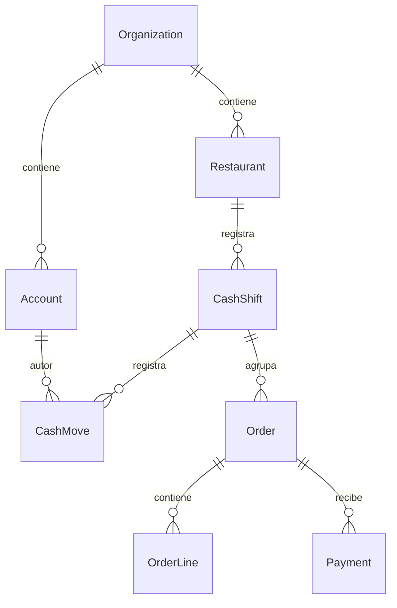

# Arquitectura vigente y alcance de la ronda

Las rutas están en `experience/experience_project/urls.py`: `/api/pos/v1/`,
`/api/platform/v1/` y las rutas del comensal incluidas desde `experience_app`.
El POS reenvía `/experience/` al backend (`pos/next.config.ts`). El despliegue
está preparado en `deploy/`; esta ronda no lo aplica.

Relaciones verificadas en `tenancy/models.py`, `accounts/models.py` y
`sales/models.py`. El diagrama recorta el dominio a los cambios de caja;
no representa todos los modelos ni certifica todos los flujos del producto.
